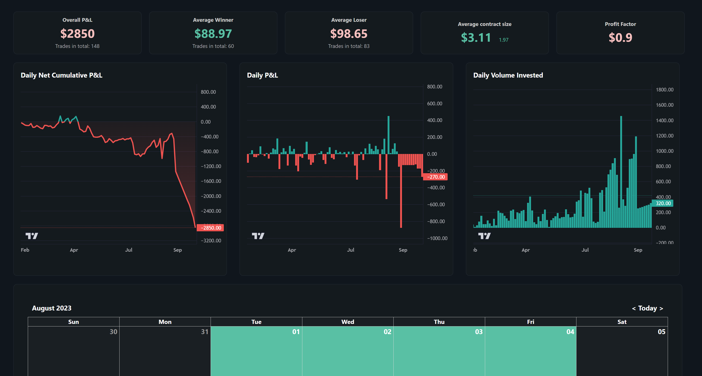

# Financial Bento Grids

The Financial Bento Grids project is designed to display trade history in an interactive Bento grid format. The backend script `retrieval.py` fetches the necessary trading data, and the frontend, built with React, presents this data in a user-friendly grid interface. This allows users to easily view and analyze their trading activities.



## Features

- **Trading History Metrics**: Displays various trading history metrics, providing a comprehensive overview of trading activities.
- **Zoomable Charts**: Includes charts that are zoomable, allowing users to focus on specific time periods or data points for detailed analysis.
- **PnL Calendar**: Features a calendar that displays the profit and loss for each day, helping users track their financial performance over time.


## Setup Instructions

To set up the backend for data retrieval and start the frontend, follow these steps:

1. **Run the backend setup script**:
   ```bash
   python retrieval.py

2. **Run the frontend script**:
   ```bash
   npm install
   npm run build
   npm start